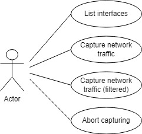
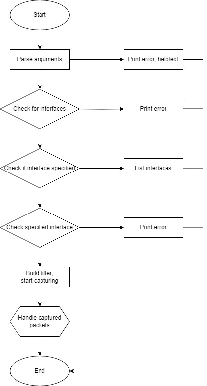
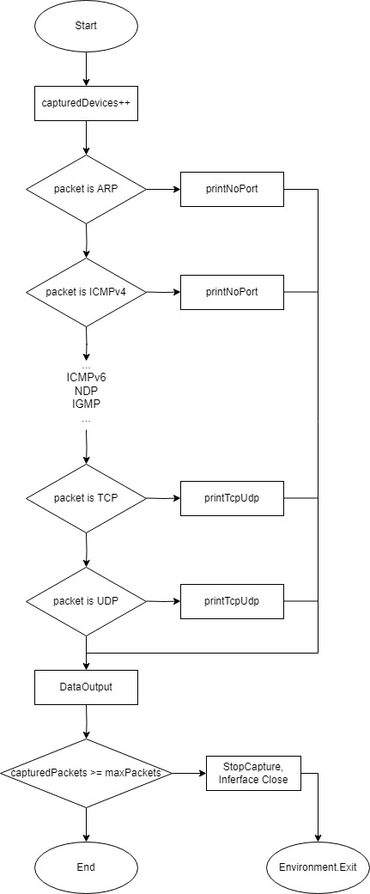
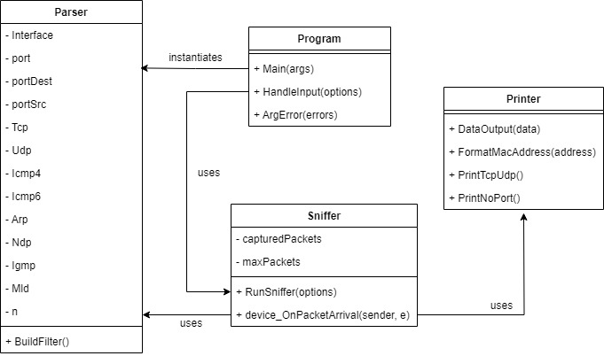
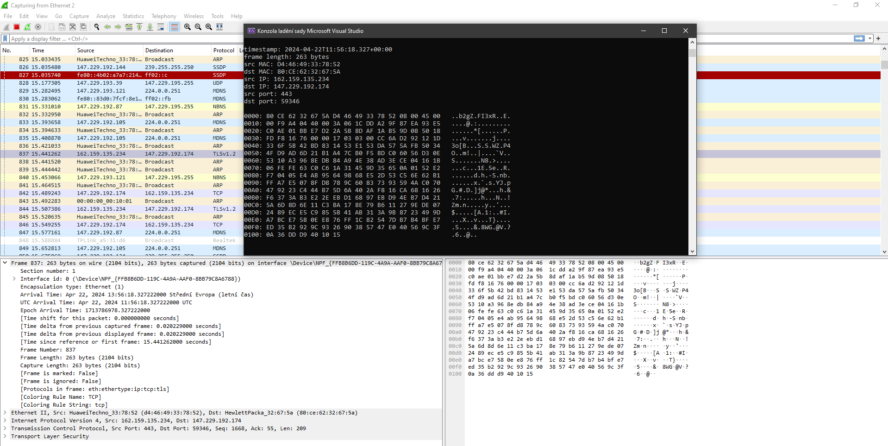
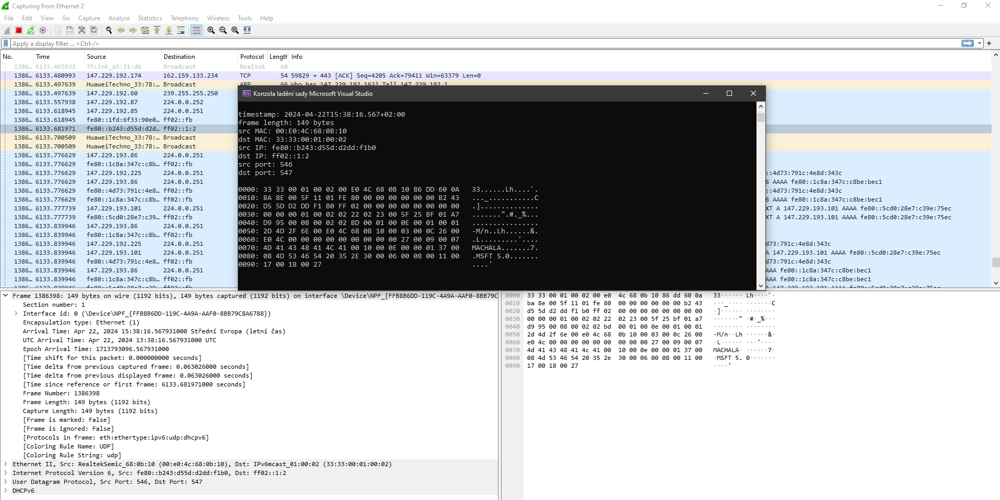
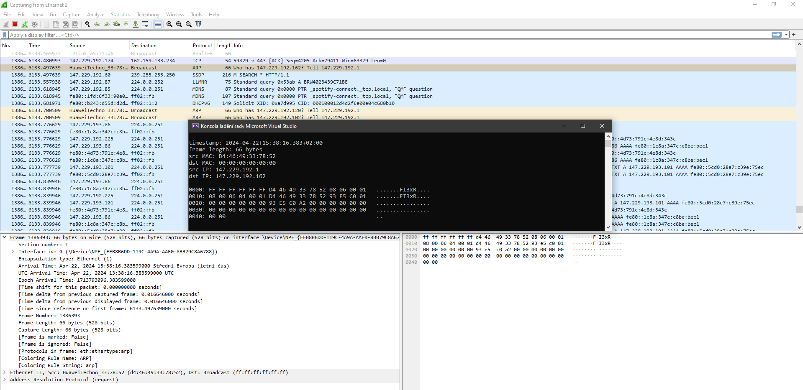

# IPK-sniffer
## Description
IPK-sniffer is an application that through a specified network interface captures packets travelling across a network. Captured packets are decoded and their data is printed onto standard output. The data is interpreted in a user friendly way, showing basic information extracted from the packet such as source and destination IP addresses along with all of the data printed in a byte offset. The application is able to capture and interpret TCP, UDP, ARP, IGMP, NDP, ICMPv4 and ICMPv6 packets.
The application is made with 4 key usecases. Displaying available interfaces, on which the user can then make the application listen in on the network traffic, being able to specify filters and the desired amount of intercepted packets.

## Dependencies
IPK-sniffer is implemented using C# using .NET 8.0 and is dependent on the following NuGet packages:

 - CommandLineParser - version 2.9.1 - used for parsing arguments
 - PacketDotNet - version 1.4.7 - used by SharPcap
 - SharPcap - version 6.3.0 - used for working with network interfaces
## Building project
The console application is built using `dotnet build`, which is the way the build is implemented within the makefile file present in the project root directory. The makefile builds the project using dotnet and outputs the binary to a newly created directory called `build`. The build is initiated using the command:

    make
A clean command has been implemented as well using dotnet, which also removes the build directory. The clean is initiated using the command:

    make clean
   
   ## Functionality
Here is a brief summary of how the application works. First, the program class parses arguments by instantiating and using the parser class, which employs the CommandLine parser. Depending on the validity of the arguments, the program either handles the input or crashes after outputting a help message. If the arguments are correct, the program follows up by checking for the validity of the supplied interface, or in case of no specified interface, prints out a list of all available interfaces. If the interface is supplied correctly, the program starts listening in on the traffic using the sniffer class. Keeping track of the ammount of packets already captured, the sniffer captures packets and determines their type by analyzing them using PacketDotNet. Sniffer uses supplied options to build a filter using the parser class. According to the type of the packet, sniffer uses the class printer to output infrormation about the packets, before printing all the data in a byte offset. Afterwards, sniffer checks whether the amount of packets captured is equal (or greater) to the max amount of desired packets and correctly terminates the program if it is. 
Below is a flowchart summarising the flow of the application.

The captured packets are handled in the method device_OnPacketArrival. The packet is first extracted into mutiple variables as various packet types. The program makes use of the fact, that only the variable of the correct packet type will not be null, and so it checks for the condition on all of them. Due to the somewhat inelegant implementation, I decided to provide a flowchart for better understanding.

### Classes
As mentioned in the Functionalit chapter, the application is consisted of 4 classes.

 - Program
 - Parser
 - Sniffer
 - Printer

Program class contains the Main function and is where the application starts. It  handles the input and finds out what usecase has been prompted and makes sure it can be prompted. 
Parser class is used by CommandLine parser to parse supplied arguments, alternatively it is used to construct a filter for the sniffer. It stores data about the arguments and an instance of Parser is used by Sniffer.
The Sniffer class takes case of the main focus of the project. It uses SharPcap and PacketDotNet to listen in on the network traffic and interprets the 
data comprehensibly. It uses the Printer for outputing the data. 

## Testing
The application was tested by using it on a specific interface side by side with wireshark. Following images contain matching outputs on both the ipk-sniffer and wireshark.

## Bibliography

 - PacketDotNet public repository: https://github.com/dotpcap/packetnet
 - SharpPcap public repository: https://github.com/dotpcap/sharppcap

